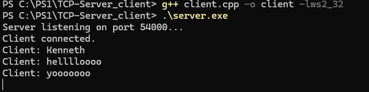

# Barebones TCP-Server_client-Implementation in C++

A very simple and barebones TCP server and client implementation using Winsock2 in C++.

This Project demonstrates basic socket communication where a client sends messages to a server, and the server echos them back.

---

## ⚙️Requirements

- WIndows 10/11
- [MingGW](https://www.mingw-w64.org/)

---

## 🛠️ Build Instructions
```bash
g++ server.cpp -o server -lws2_32
g++ client.cpp -o client -lws2_32
```

## how to run
1. open two seperate terminals(powershell or command prompt)
2. in the first terminal, run the server.
   ```bash
   server.exe
   ```
3. in the second terminal, run the client:
   ```bash
   client.exe
   ```
4. type messages in the client terminal and the server will echo the message back.

## Features
- Handles basic TCP communication
- uses `std::getline()` for user input
- extremly barebones so nothing much, lol

## Example 


